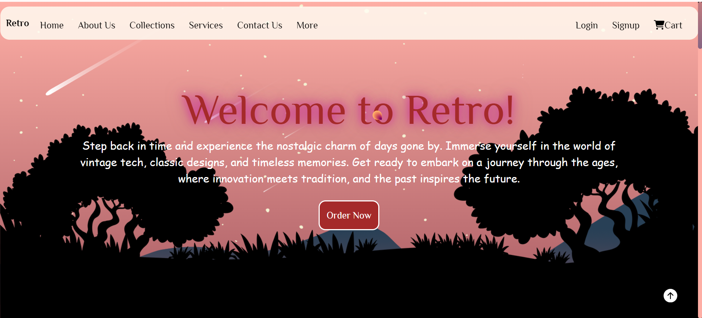
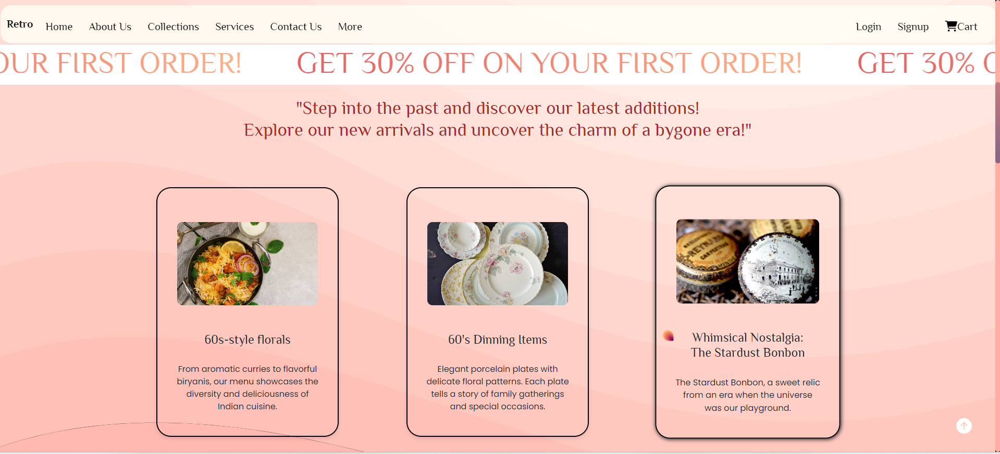
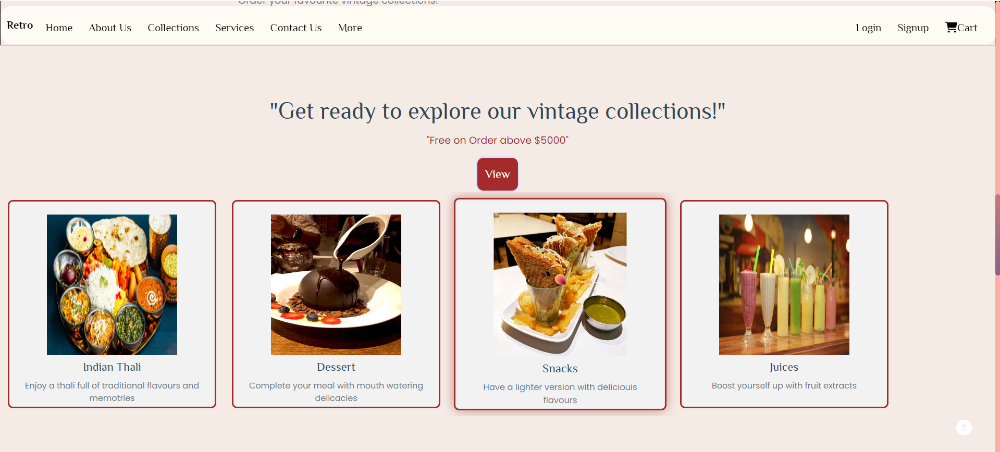

<div align = "center">

<div align="center">

# <p>Retro</p>

<i><p>An online platform providing items of vintage collections!</p></i>

</div>

<table align="center">
    <thead align="center">
        <tr border: 1px;>
            <td><b> Stars</b></td>
            <td><b>🍴 Forks</b></td>
            <td><b> Issues</b></td>
            <td><b> Open PRs</b></td>
            <td><b> Closed PRs</b></td>
        </tr>
     </thead>
    <tbody>
         <tr>
            <td></td>
             <td></td>
            <td></td>
            <td></td>
           <td></td>
        </tr>
    </tbody>
</table>
</div>

# Table of Contents

1. [Featured In](#featured-in)
2. [About Us](#about-us)
3. [Tech Stack](#tech-stack)
4. [Get Started](#get-started)
5. [Contributing](#contributing)
6. [Website Preview](#website-preview)
7. [Our Contributors](#our-contributors)
8. [Stargazers](#stargazers)
9. [Forkers](#forkers)
10. [Code of Conduct](#code-of-conduct)
11. [License](#license)


## Featured In
<table>

   <tr>
      <th>Event Logo</th>
      <th>Event Name</th>
      <th>Event Description</th>
   </tr>
   <tr>
      <td></td>
      <td>GirlScript Summer of Code 2024</td>
      <td>GirlScript Summer of Code is a three-month-long Open Source Program conducted every summer by GirlScript Foundation. It is an initiative to bring more beginners to Open-Source Software Development.</td>
   </tr>
    <tr>
      <td></td>
      <td>Hacktoberfest 2024</td>
      <td>Hacktoberfest is a month-long celebration of open source software run by DigitalOcean, GitHub, and Twilio. It encourages contributions to open source projects and promotes a global community of developers.</td>
   </tr>

</table>

## About Us
<p style="font-family:var(--ff-philosopher);">
Welcome to RETRO! 🌕✨ We invite you to explore the vintage look, a unique journey through timeless designs and aesthetics. Our platform celebrates the elegance of the past, blending classic styles with modern usability to create a seamless, visually stunning experience.

At Retro, we believe that beauty lies in the details, and our website reflects a passion for vintage-inspired design that transports you to a world where nostalgia meets innovation. Whether you're here for inspiration, design exploration, or simply to immerse yourself in a vintage ambiance, we aim to make your experience truly special.

Discover the charm of the past and embrace a sophisticated, artistic vibe that never goes out of style. Join us, and let's relive the beauty of the bygone eras, one step at a time! 🌸🕰️

It is an online platform which enables you to get information about your vintage collections and to place the orders.</p>

## <p style="font-family:var(--ff-philosopher);font-size:3rem;text-align:center;">Tech Stack</p>
<a href="https://developer.mozilla.org/en-US/docs/Glossary/HTML5">  </a> <p>HTML5 structures the website's content, enabling modern multimedia support and semantic layout.</p><br> <a href="https://developer.mozilla.org/en-US/docs/Web/JavaScript">  </a> <p>JavaScript adds interactivity, making the site dynamic with features like form validation and real-time content updates.</p><br> <a href="https://getbootstrap.com/">  </a> <p>Bootstrap provides a responsive framework with pre-built components for consistent design across devices.</p><br> <a href="https://developer.mozilla.org/en-US/docs/Web/CSS">  </a> <p>CSS3 styles the website, enhancing its appearance and ensuring an adaptive layout.</p><br>

<br><br>

## <p style="font-size:3rem;">Get Started</p>

### Setup and Installation

<p style="font-family:var(--ff-philosopher);">To contribute to the Retro repository, follow these steps:</p>

1. **Fork the Repository:**
   Click on the "Fork" button on the repository's GitHub page to create a copy of the repository in your GitHub account.

2. **Clone the repository:**
   Clone the forked repository to your local machine using the following command in your terminal.
   ```bash
   git clone https://github.com/<your-github-username>/Retro
   ```
3. **Add a remote upstream:**
   ```bash
   git remote add upstream https://github.com/original-owner-username/Retro
   ```
4. **Create a new branch:**
   Create a new branch for your changes. Run the following command in your terminal.
   ```bash
   git checkout -b <your-branch-name>
   ```
5. **Make the desired changes:**
   Make the desired changes to the source code.

6. **Add your changes:**
   Add your changes to the staging area. Run the following command in your terminal.
   ```bash
   git add <File1 changed> <File2 changed> ...
   ```
7. **Commit your changes:**
   Commit your changes with a meaningful commit message. Run the following command in your terminal.
   ```bash
   git commit -m "<your-commit-message>"
   ```
8. **Push your changes:**
   Push your changes to your forked repository. Run the following command in your terminal
   ```bash
   git push origin <your-branch-name>
   ```
9. **Create a Pull Request:**
   Go to the GitHub page of your forked repository. You should see a prompt to create a pull request (PR). Click on it, compare the changes, and create the PR.
10. **Update Branch**
    Always remember to update the branch by clikcing below sync fork in your forked repo , which is loctaed in your github repo's.
    

<br><br>


## <p style="font-family:var(--ff-philosopher);font-size:3rem;text-align:center;"> Contributing </p>

<p style="font-family:var(--ff-philosopher);font-size:2rem;">We appreciate your feedback! Our goal is to make contribution to this project as easy and transparent as possible. Whether you're interested in:</p> <ul style="font-size:1.5rem;"> <li>  <strong>Reporting a bug</strong> </li> <li>  <strong>Discussing the current state of the code</strong> </li> <li>  <strong>Submitting a fix</strong> </li> <li>  <strong>Proposing new features</strong> </li> </ul> <p style="font-size:1.5rem;">To get started with contributing, please follow the steps outlined in the <a href="Contributing.md" style="color: #007bff; text-decoration: none;">Contributing.md</a>.</p>

## Website Preview📸
<br>




🌐 **Visit our website:** [Retro](https://rococo-mooncake-0d89f7.netlify.app/)  
<br>

 ## <h2 style="font-size:3rem;">Our Contributors </h2>
  <h3>Thank you for contributing to our repository</h3>
<a href="https://github.com/anjaliavv51/Retro/graphs/contributors">


## Stargazers

<div align='center'>

[](https://github.com/Anjaliavv51/Retro/stargazers)

</div>

## Forkers
<div align='center'>

[](https://github.com/Anjaliavv51/Retro/network/members)

# Code of Conduct
We are committed to fostering a welcoming and inclusive environment for everyone. All contributors and participants are expected to uphold the following values:

- Be respectful of different viewpoints and experiences.
- Show empathy toward others.
- Use inclusive language.

Please read and follow our [Code of Conduct](CODE_OF_CONDUCT.md) to foster an inclusive community.
If anyone violates these standards, they may be banned from the community.

## License 📜 

This project is licensed under the MIT License. For more details, see the [LICENSE](LICENSE.txt) file.

<div align="center">
    <a href="#top">
        
    </a>
</div>

<center>
<h3 style="font-size:2rem;">
If you find this project helpful, please consider giving it a star! </p>
</center>
