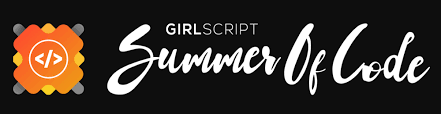

<div align = "center">

<div align="center">

# <p>Retro</p>

<i><p>An online platform providing items of vintage collections!</p></i>

</div>

<table align="center">
    <thead align="center">
        <tr border: 1px;>
            <td><b> Stars</b></td>
            <td><b>🍴 Forks</b></td>
            <td><b> Issues</b></td>
            <td><b> Open PRs</b></td>
            <td><b> Closed PRs</b></td>
        </tr>
     </thead>
    <tbody>
         <tr>
            <td></td>
             <td></td>
            <td></td>
            <td></td>
           <td></td>
        </tr>
    </tbody>
</table>
</div>

# 🎥Demo 

https://github.com/user-attachments/assets/9fbd2c41-09e1-4843-88d5-5ee2e64de43d


# Table of Contents

1. [Featured In](#featured-in)
2. [About Us](#about-us)
3. [Tech Stack](#tech-stack)
4. [Installation Instructions](#installation-instructions)
5. [Contributing](#contributing)
6. [Website Preview](#website-preview)
7. [Our Contributors](#our-contributors)
8. [Stargazers](#stargazers)
9. [Forkers](#forkers)
10. [Code of Conduct](#code-of-conduct)
11. [License](#license)


## Featured In [](https://github.com/ellerbrock/open-source-badges/)
<table>

   <tr>
      <th>Event Logo</th>
      <th>Event Name</th>
      <th>Event Description</th>
   </tr>
   <tr>
        <td></td>
        <td><a href="https://www.socialwinterofcode.com/">Social Winter of Code Season-5 (SWOC) </a>2024-2025</td>
       <td><p>Social Winter Of Code is the 2 month long open source program, with the aim to introduce more and more people to the world of Open source. In this program all the selected participants will get a chance to work on various exciting projects under the guidance of experienced Mentors.</p></td>
    </tr>
   <tr>
      <td></td>
      <td>GirlScript Summer of Code 2024'EXTD</td>
      <td>GirlScript Summer of Code is a three-month-long Open Source Program conducted every summer by GirlScript Foundation. It is an initiative to bring more beginners to Open-Source Software Development.</td>
   </tr>
    <tr>
      <td></td>
      <td>Hacktoberfest 2024</td>
      <td>Hacktoberfest is a month-long celebration of open source software run by DigitalOcean, GitHub, and Twilio. It encourages contributions to open source projects and promotes a global community of developers.</td>
   </tr>

</table>

## About Us
<p style="font-family:var(--ff-philosopher);">
Welcome to RETRO! 🌕✨ We invite you to explore the vintage look, a unique journey through timeless designs and aesthetics. Our platform celebrates the elegance of the past, blending classic styles with modern usability to create a seamless, visually stunning experience.

At Retro, we believe that beauty lies in the details, and our website reflects a passion for vintage-inspired design that transports you to a world where nostalgia meets innovation. Whether you're here for inspiration, design exploration, or simply to immerse yourself in a vintage ambiance, we aim to make your experience truly special.

Discover the charm of the past and embrace a sophisticated, artistic vibe that never goes out of style. Join us, and let's relive the beauty of the bygone eras, one step at a time! 🌸🕰️

It is an online platform which enables you to get information about your vintage collections and to place the orders.</p>

## <p style="font-family:var(--ff-philosopher);font-size:3rem;text-align:center;">Tech Stack</p>
<a href="https://developer.mozilla.org/en-US/docs/Glossary/HTML5">  </a> <p>HTML5 structures the website's content, enabling modern multimedia support and semantic layout.</p><br> <a href="https://developer.mozilla.org/en-US/docs/Web/JavaScript">  </a> <p>JavaScript adds interactivity, making the site dynamic with features like form validation and real-time content updates.</p><br> <a href="https://getbootstrap.com/">  </a> <p>Bootstrap provides a responsive framework with pre-built components for consistent design across devices.</p><br> <a href="https://developer.mozilla.org/en-US/docs/Web/CSS">  </a> <p>CSS3 styles the website, enhancing its appearance and ensuring an adaptive layout.</p><br>

<br><br>

## <p style="font-size:4rem;">Installation Instructions</p>

Follow the steps below to set up and run the project locally:

## 1. Clone the Repository
Clone the repository to your local machine using the following command:
```bash
git clone https://github.com/Anjaliavv51/Retro.git
```

## 2. Run the Frontend
The frontend is a static application. To run it:
1. Navigate to the frontend folder (if applicable) or locate the `index.html` file in the project root.
2. Open the `index.html` file in your browser.


## 3. Run the Backend

### 1. Prerequisites
Before running the backend, ensure the following software is installed on your machine:
- **Node.js**: Install a compatible version for the project. [Download Node.js](https://nodejs.org/)  
- **Git**: Version control system. [Download Git](https://git-scm.com/)  
- **pnpm**: A fast, disk-efficient Node.js package manager.  

  Install pnpm globally using npm:  
  ```bash
  npm install -g pnpm
  ```  

  Verify the installation by checking the version:  
  ```bash
  pnpm --version
  ```


### 2. Navigate to Backend
Change your directory to the backend folder:
```bash
cd backend
```


### 3. Create a `.env` File
In the `backend` folder, create a `.env` file to store environment variables:
```bash
touch .env
```


### 4. Configure Environment Variables
Add the following variables to the `.env` file:
```env
PORT=3000
MONGODB_URL=ADD YOUR MONGODB ATLAS DRIVER CONNECTION STRING
SECRET=INPUT YOUR SECRET KEY. SAMPLE: MYSECRET123
```

### 5. MongoDB URL Setup
To get the MongoDB URL, follow these steps:
1. **Login to MongoDB Atlas**: [MongoDB Atlas Login](https://account.mongodb.com/account/login?nds=true)
2. **Create a New Project**:  
   - In your MongoDB Atlas account, create a new project.  
3. **Create a New Cluster**:  
   - Under the newly created project, create a new cluster.  
4. **Create a New Database**:  
   - Inside the cluster, create a new database named `retro_db`.  
5. **Get the Connection String**:  
   - Click on the cluster, select **Connect**, and retrieve the connection string.  
   - Replace `<username>` and `<db_password>` with your MongoDB Atlas credentials.  
   Example:  
   ```bash
   mongodb+srv://<username>:<db_password>@cluster....mongodb.net/retro_db
   ```


## **4. Start the Backend**
1. Install dependencies using `pnpm`:
   ```bash
   pnpm install
   ```
2. Start the backend server:
   ```bash
   pnpm start
   ```
3. The backend should now be running on `http://localhost:3000`.

<br>

## Contributing

>⚠️Before contributing to this project, be sure to read and adhere to the [Contributing Guidelines](https://github.com/Anjaliavv51/Retro/blob/main/Contributing.md).

Thank you for considering contributing to [Retro](https://github.com/Anjaliavv51/Retro). We welcome and appreciate contributions from the community! 

If you find a bug, have a feature request, or would like to contribute in any way, feel free to open an issue or submit a pull request. Whether you're enhancing the technical documentaion or adding a new feature, your efforts are valued, and together we can make this project even better. Thank you for considering contributing to [Retro](https://github.com/Anjaliavv51/Retro)!

<br>

## Website Preview📸
<br>


🌐 **Visit our website:** [Retro](https://rococo-mooncake-0d89f7.netlify.app/)  
<br>

 ## <h2 style="font-size:3rem;">Our Contributors </h2>
  <h3>Thank you for contributing to our repository</h3>
<a href="https://github.com/anjaliavv51/Retro/graphs/contributors">


## Stargazers

<div align='center'>

[](https://github.com/Anjaliavv51/Retro/stargazers)

</div>

## Forkers

[](https://github.com/Anjaliavv51/Retro/network/members)

# Code of Conduct
We are committed to fostering a welcoming and inclusive environment for everyone. All contributors and participants are expected to uphold the following values:

- Be respectful of different viewpoints and experiences.
- Show empathy toward others.
- Use inclusive language.

Please read and follow our [Code of Conduct](CODE_OF_CONDUCT.md) to foster an inclusive community.
If anyone violates these standards, they may be banned from the community.

## License 📜 

This project is licensed under the MIT License. For more details, see the [LICENSE](LICENSE.txt) file.

<div align="center">
    <a href="#top">
        
    </a>
</div>

<center>
<h3 style="font-size:2rem;">
If you find this project helpful, please consider giving it a star! </p>
</center>
